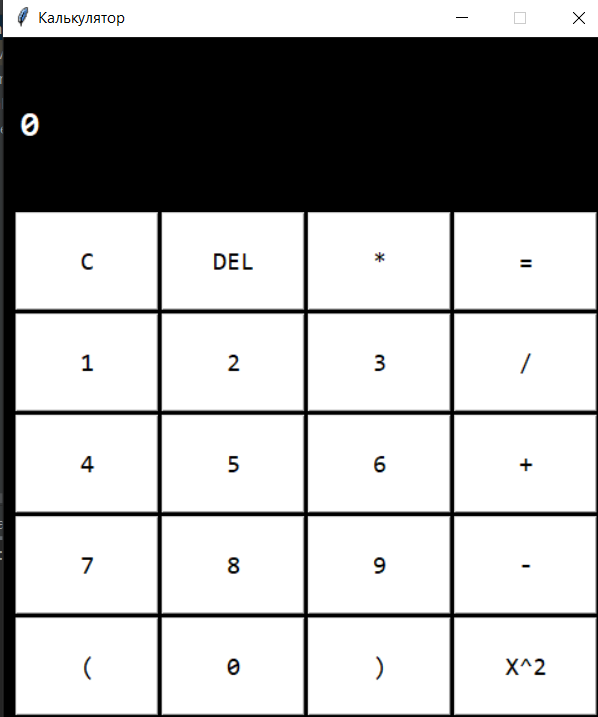

# PythonCalculator
This is a simple calculator written using Tkinter on Python

<h1 align='center'>Hi there, I'm <a href='https://inginirium.ru/", target='_blank'> Inginirium Student 👋<a></h1>

  

  
<h2 align='center'>Computer Science Student</h2>
